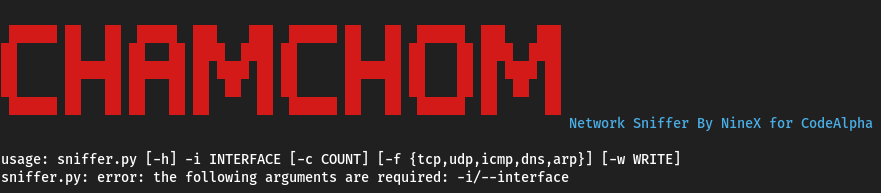

# Chamchom

Chamchom is a network sniffer developed by NineX for CodeAlpha. It captures and displays network packets with detailed information about the protocols and endpoints involved. Chamchom is built using Python and Scapy, with support for various protocols and a colorful, user-friendly output.



## Features

- Captures TCP, UDP, ICMP, DNS, ARP, and Ethernet packets
- Displays detailed information about each packet, including timestamp, protocol, source IP, source port, destination IP, and destination port
- Supports packet filtering by protocol
- Option to save captured packets to a PCAP file

## Installation
**Clone the repository**:
   ```bash
   git clone https://github.com/nineX10011/Chamchom.git
   cd Chamchom
```

## Requirements

- Python 3.x
- Scapy
- PrettyTable
- Colorama

You can install the required Python packages using the provided `requirements.txt` file:

```bash
pip install -r requirements.txt
```

## Usage

To run Chamchom, use the following command:

```bash
sudo python3 sniffer.py -i <interface> [-c <count>] [-f <filter>] [-w <output_file>]
```

### Options

- `-i, --interface`: Network interface to sniff (e.g., eth0) (required)
- `-c, --count`: Number of packets to capture (default: unlimited)
- `-f, --filter`: Filter packets by protocol (e.g., tcp, udp, icmp, dns, arp)
- `-w, --write`: Write captured packets to a PCAP file

### Examples

Capture packets on interface `eth0`:

```bash
python sniffer.py -i eth0
```

Capture 100 TCP packets on interface `eth0`:

```bash
python sniffer.py -i eth0 -c 100 -f tcp
```

Capture packets on interface `eth0` and save them to `capture.pcap`:

```bash
python sniffer.py -i eth0 -w capture.pcap
```

## Code Overview

### `sniffer.py`

The main script that handles packet capturing and displays the packet information in a colorful, tabular format.

### `utils.py`

Contains utility functions to determine the protocol of a packet based on its content.

## License

This project is licensed under the MIT License - see the [LICENSE](LICENSE) file for details.

## Acknowledgements

Chamchom uses the following libraries:
- [Scapy](https://scapy.net/)
- [PrettyTable](https://pypi.org/project/PrettyTable/)
- [Colorama](https://pypi.org/project/colorama/)

  
